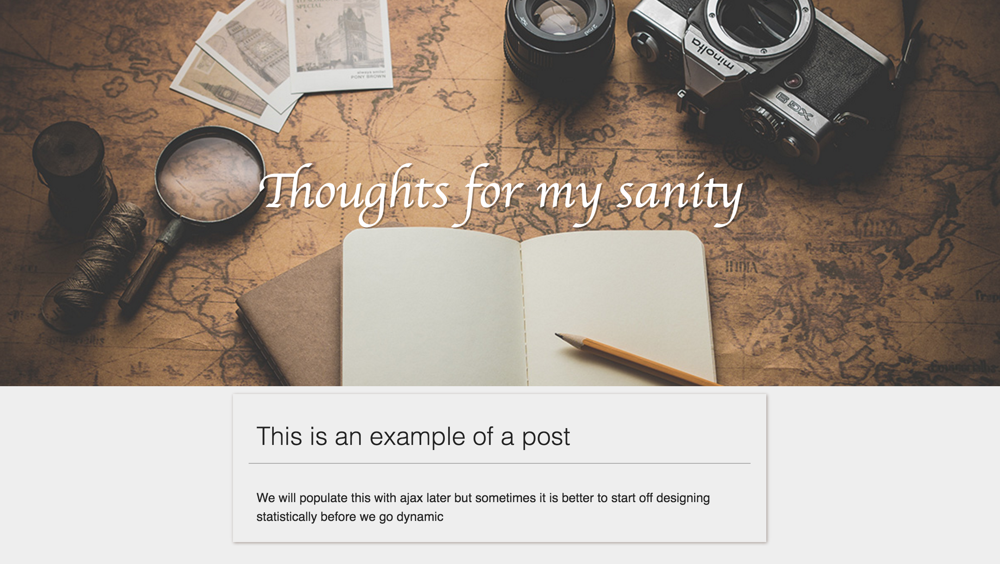
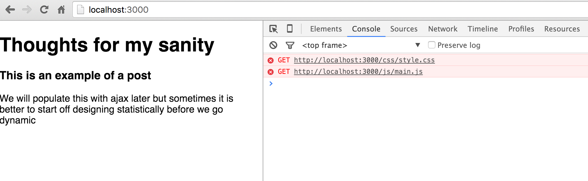

# Lab 4 - updated

## Tutorial Expected Objective

We will create a diary app for you to keep track of ~~your sanity before this course drives you into madness~~ your great SE experience so that your children may hear of your great conquest ~~and honer th sous of our fallen comrades~~.

While working on the app we will demonstrate a good git work flow.

By the end of the lab you should have acquired.

- An understanding of (node package manager) npm
    - node module syntax (require/export)
    - npm install
- Create package.json
    - read package.json
    - npm install from package and adding dependency
    - npm test
    - npm run [script]
- Build a simple express app
- Serve static files
    - load some javascript and some css as separate files
- Update our interface with jQuery
- Update our interface data from a json file
- Build a simple API
- Query The API with jQuery and update our page

## Requires

- Internet
- Google chrome
- A plain text editor (preferably sublime)
- mongodb
- nodejs
- git
- npm packges mocha, chai, supertest istanbul

## Pre

- If you haven't yet fill this [form][student-form] while creating a github account

## Pre-requisite

- Lab 2 is a prerequisite to redo it assuming you cloned the se-tutorial repo

```
$ git checkout lab-2-start
```

## Tutorial Guide

To follow along this tutorial just

```
$ git checkout lab-4-start
```


### What is npm

The nodeJS eco-system has an abundance of packages that make carrying this forward easier and they are all stored on [npm][npm].

npm allows developers to share code across projects we bundle this code in modules that we call packages.

To learn more about npm see their [getting started guide][npm]. most notably there's a short npm install [locally][npm-install] and [globally][npm-install-g], more on install syntax [here][npm-install-more].

### Package.json

All package related information about our app is note din package.json

Since the package philosophy is based on making every package as small and reusable as possible, npm packages often have other packages __dependencies__.

For more on this see [this section][npm-packages] of the npm getting started guide.

### Starting our project

There are many ways to start a project, there are many project generators that you can use similar that will create some files as your starting point.

In the previous version of this lab we had an [external tutorial][express-rest] on building a restful app that used the express generator.

We will also use a generator later on in the future but for now we will walk you though creating your project manually.

Create a folder for our project (diary for example) and `cd` into it

```
$ mkdir sanity-diary && cd sanity-diary
```

open sublime inside this folder

```
$ subl .
```

Create a minimal package.json file as described [here][npm-packages] either through the command or by writing it yourself.

You should wind up with something that looks like this

```json
{
  "name": "diary",
  "version": "0.0.1",
  "author": "Amr Draz <amr.m.draz@gmail.com>"
}
```

### Basic express server

#### Basic server
If you remember in lab-2 we constructed a basic node server

```js
// server.js
var http = require('http');

var handleRequest = function handleRequest(request, response){
        response.writeHeader(200, {'Content-type':'text/plain'});
        response.end('Server is working you visited: ' + request.url);
    }
}
var server = http.createServer(handleRequest);

var PORT = 8080; 
server.listen(PORT, function(){
    console.log("Server listening on: http://localhost:%s", PORT);
});
```

And when we want to serve html files, we would do something like this

```js
// server.js

var http = require('http');
var fs = require('fs');

var handleRequest = function handleRequest(request, response){
    if (request.url==='/index.html') {
        response.writeHeader(200, {'Content-type':'text/html'});
        response.end(fs.readFileSync('./app/index.html'));
    } else {
        response.writeHeader(404, {'Content-type':'text/html'});
        response.end(fs.readFileSync('./app/404.html'));
    }
};
var server = http.createServer(handleRequest);

var PORT = 8080; 
server.listen(PORT, function(){
    console.log("Server listening on: http://localhost:%s", PORT);
});
```

However as the node community recognizes this would've evidently not scale very well.

#### install express

[ExpressJS][express] is a simple micro-framework that is highly expendable.

We will be using it in our project so we will add it as a dependency.

If you understand that express is a package and how npm install works you should be able to pick the correct command form the [express install guide][express-install]. You will need the Internet at this point.

When you're done your package.json should look like this (at the time of writing this tutorial).

```json
{
  "name": "diary",
  "version": "0.0.1",
  "author": "Amr Draz <amr.m.draz@gmail.com>",
  "dependencies": {
    "express": "^4.13.4"
  }
}
```

and your app folder should look like this

```
 /Users/draz/se-project/se-tutorial/diary
|-- node_modules
`-- package.json
```

#### app.js

Now write a [hello world express  app][express-hello] and run it to try it out.

If you follow along you should be capable of testing it at [http://localhost:3000](htttp://localhost:3000).

You should now have a directory structure that looks like this

```
 /Users/draz/se-project/se-tutorial/diary
|-- app.js
|-- node_modules
`-- package.json
```

#### npm start

It is always best to abstract away unneeded development details from other people.

Now we could type `node app.js` every time we want to start the app, but what if we decide to do things differently later on like use nodemon instead of node or other start commands.

Better to setup a [facade](https://sourcemaking.com/design_patterns/facade) in front of the app starting logic.

We will add a start script to our package.json in order to unify our app start command (also the command may become longer later).

Your package.json should now look something like this.

```json
{
    "name": "diary",
    "version": "0.0.1",
    "author": "Amr Draz <amr.m.draz@gmail.com>",
    "scripts": {
        "start": "node app.js"
    },
    "dependencies": {
        "express": "^4.13.4"
    }
}
```

and now we can start the app with

```
$ npm start
```

You can learn more about express from their website [guide](http://expressjs.com/en/guide/routing.html) and [api refrence](http://expressjs.com/en/4x/api.html) when you need too.

## Express Serving a file

In lab-1 we created a simple google.com page and in it we wrote all our html in addition to the css code.

```html
<!DOCTYPE html>
<html>
<head>
    <title>Google</title>
    <style>
        body {
            text-align: center;
            font-family: Arial;
        }
        .search {
            width: 400px;
        }
    </style>
</head>
<body>
    <h1>Google</h1>
    <form action="http://www.google.com" method="get">
        <input class='search' type="text" placeholder="Search" name="q">
        <div>
            <input type="submit" value="Search">
            <input type="submit" value="I'm feeling luck">
        </div>
    </form>
</body>
</html>
```

Create a folder called static in your project and add an html file called index.html

You can then update the app.js file as follows

```js
var express = require('express');
var app = express();

app.get('/', function (req, res) {
  res.sendFile(__dirname + '/static/index.html');
});

app.listen(3000, function () {
  console.log('Example app listening on port 3000!');
});
```

To understand how `sendFile()` works see [the express api refrence](http://expressjs.com/en/api.html#res.sendFile)

> Note: Make it a habit to look up things you don't know.


Your directory should now look like this

```
|-- app.js
|-- node_modules
|-- package.json
`-- static
   `-- index.html
```


### Static Files

A static resource page is a page that is served as is and was not generated pragmatically.

Examples of these resources are html, css, javascript, images, video, and audio files to name a few.

In practice it is generally better to not embed css and javascript code in your html page, and instead split them to separate files and folders.

We will start implementing our hip diary app so let's change index.html.

```html
<!DOCTYPE html>
<html>
<head>
    <title>My Diary</title>
    <link rel="stylesheet" href="https://cdnjs.cloudflare.com/ajax/libs/normalize/3.0.3/normalize.min.css" />
    <link rel="stylesheet" href="css/style.css" />
</head>
<body>
    <header>
        <h1>Thoughts for my sanity</h1>
    </header>
    <section class="post-list">
        <article class="post-list-item">
            <h3 class="post-list-item-header">This is an example of a post</h3>
            <section class="post-list-item-body">
                We will populate this with ajax later but sometimes it is better to start off designing statistically before we go dynamic
            </section>
        </article>
    </section>
    <script src="js/main.js"></script>
</body>
</html>
```

The [<link>](http://www.w3schools.com/tags/tag_link.asp) and [<script>](http://www.w3schools.com/tags/att_script_src.asp) tags are used to refer to external css and javascript files respectively.

You should:-

1. Add a `css` and `js` folder to your static file directory.
2. Add a `style.css` empty file in your css folder
3. Add a `main.js` empty file in your js folder

You can open the index.html file in your browser by double clicking on the file, dragging it to the browser.

You should see something like this


If you're wondering what __normalize.css__ does

```html
<link rel="stylesheet" href="https://cdnjs.cloudflare.com/ajax/libs/normalize/3.0.3/normalize.min.css" />
```

Then you're asking the right questions and I salute your constructive curiosity, you can find out by [goggling of course](http://lmgtfy.com/?q=normalize.css).

You might also notice we're not referring to it from our local file system but from another website.

This will help illustrate a point later.

Try removing the nomralize.css link tag to see how the site looks without it


Now put it back and add the following to your `style.css` file

```css
* {box-sizing: border-box;}
html {
    height: 100%;
}
body {
    min-height: 100%;
    color: #222;
    line-height: 1.5;
    background: #eee;
}
.header {
    height: 500px;
    
    display: flex;
    align-items: center;
    justify-content: center;

    background-color: #345;
    /* https://css-tricks.com/perfect-full-page-background-image/ */
    background: url(../img/header.jpeg) no-repeat center center fixed;
    background-size: cover;

    margin-bottom: 10px;
}
.header h1 {
    max-width: 50%;
    color: #fff;
    text-shadow: 2px 2px rgba(0, 0, 0, 0.3);
    font-size: 4em;
    font-weight: 200;
    font-family: cursive;
}
.post-list {
    margin: 0 auto;
}
.post-list-item {
    overflow:auto;
    margin: 10px auto;
    width: 50%;
    box-shadow: 1px 1px 5px rgba(49, 21, 4, 0.4);
    min-height: 140px;
    padding: 20px 20px;
}
.post-list-item-header {
    padding: 0 0 10px 10px;
    font-weight: 200;
    font-size: 2em;
    border-bottom: 1px solid rgba(0,0,0,0.3);
    margin-top: 10px;
}
.post-list-item-body {
    padding: 0 10px;
}
```


> The image in the background is found in the repo under `assets/diary-app/header.jpeg`

If you refresh your web page right now you should now see something like this.



### Express exposing a static directory

If we now go back to our terminal, run our server and visit `http://localhost:3000` we will see the page unstyled.


But you may notice that normalize is still active, this is because it is served from another server, the problem has to do with our server.

You can tell if there are errors in the browser by opening the developer tools and looking in the console tab (right click and inspect element)



You should see that the server is responding with a 404 in the networks tab


This is because we only told express to serve a file when we visit `/` and no other route was defined.

We could add this to our app.js

```js
app.get('/css/style.css', function(req, res) {
   res.sendFile(__dirname + '/static/css/style.css'); 
});
```

But it is unreasonable to have to define a new route for every new file we want to serve.

Instead we can expose a static directory

You might want to read about how the [express routes work](http://expressjs.com/en/starter/basic-routing.html) and how you can set a static [folder in express][express-static]

In fact since our index.html is static file we no longer need to define it's route. your app.js should look like this.

```js
var express = require('express');
var app = express();

app.use(express.static('./static'));

app.listen(3000, function () {
  console.log('Example app listening on port 3000!');
});
```

Restart your server and refresh your webpage everything should now look dandy.

We This have created a simple static server now everything you put in your static folder will be accessible through your site.

### Static Dynamic Sites

It is possible to manipulate our web page using JavaScript.

For instance we can select our post header and change its text like so.

Add this to your main.js file

```js
document.querySelector('.post-list-item-header').innerHtml = "Title added with javascript";
```

> If you're thinking I don't understand what document.querySelector means or innerHTML, Then congratulations once again you are right you shouldn't maybe goggling what they are may enlighten you.

Now how about you add to your javascript file some code that will select the body of the post and update it to say something like `"This body text was also modified with javascript"`.

#### JQuery select/update

We can make our code look smaller along with simplifying some functionality later by using JQuery.

First You will need to add jQuery to our webpage I'll leave it up to you to figure that one out.

> In case you still didn't click this [link for shame](http://lmgtfy.com/?q=add+jquery+to+my+page)

> Note: You should add it before our main.js script since it depend on it.

Your main.js should now look like this

```js
$('.post-list-item-header').html("Title added with JavaScript");
$('.post-list-item-body').html("This post's body text was populated with javascript too");
```

Preview your webapp in the browser to make sure everything works.


In case something is wrong just open the browser console and see if there are any errors and resolve them, Google is your friend.


#### Event triggered actions

Right now our post is updated immediately on page load. We can change that by having it update only when a certain event is triggered.

We will add a button to our page just before our `post-list` section.

```html
<button class="post-load-btn">Load Post</button>
```

Add this to your `styles.css` file

```css
.post-load-btn {
    margin: 0 auto;
    display: block;
    cursor: pointer;
    width: 50%;
    font-size: 2em;
    background: #3C3C3C;
    color: #fff;
    border: none;
    box-shadow: 1px 1px 5px rgba(49, 21, 4, 0.4);
}
.post-load-btn:hover {
    background-color: #555;
}
```

##### Update on click

Now in our main.js add a click event that updates the post on click.

```js
// main.js
$('.post-load-btn').on('click', function (event) {
    $('.post-list-item-header').html("Title added with JavaScript");
    $('.post-list-item-body').html("This post's body text was populated with javascript too");
});
```

> It is possible to trace your code by typing using `console.log()` to check that everything is working fine.

Test your code, check the browser console for errors.

### Ajax

It is generally a good idea to model our data which makes it easier to scale our code.

We will clean up main.js to look like this

```js
// main.js
var post = {
    "header": "Title added with JavaScript",
    "body": "This post's body text was populated with JavaScript too"
};

$('.post-load-btn').on('click', function (event) {
    $('.post-list-item-header').html(post.header);
    $('.post-list-item-body').html(post.body);
});
```

Now that we abstracted away our data from our code we can think of different ways of getting the data.

When populating our post data we may want to load this data form somewhere else, say a database for example.

To do this we use a technology called AJAX which allows us to load data asynchronously without reloading the page.

#### Data from a JSON file

So first let's take out out post data and move it to another file say post.json

Add a post.json file to our static folder

```json
{
    "header": "Title added with Ajax from a JSON file",
    "body": "This post's body text was populated with JavaScript"
}
```

And now let's get it with [AJAX](http://www.w3schools.com/jquery/ajax_ajax.asp)

```js
//main.js
$('.post-load-btn').on('click', function (event) {
    $.ajax({
        url: 'post.json',
        success: function (post) {
            $('.post-list-item-header').html(post.header);
            $('.post-list-item-body').html(post.body);
        }
    });
});
```

> Note: You don't need jQuery to do ajax calls jQuery just provides a nice syntax for executing ajax requests that's all.

> Note: just like we loaded a json file with ajax we can load a css, html, text, javascript or any other file.

### Loading dynamic data

The data we load may not be static like our html and css files.

In practice our data will probably be loaded from a database or file and modified later.

This is where we need to define routes in our express app to handle these various cases.

Let's add a get route `/api/post` which returns a json response

```js
// app.js

app.get('/api/post', function(req, res) {
    var post = {
        "header": "Title added with Ajax from a /api/post route",
        "body": "This post's body text was populated with JavaScript"
    }
    res.send(post)
});
```

And now we can update our main.js file to communicate withe the route instead.

```js
// main.js

$('.post-load-btn').on('click', function (event) {
    $.ajax({
        url: 'api/post',
        success: function (post) {
            $('.post-list-item-header').html(post.header);
            $('.post-list-item-body').html(post.body);
        }
    });
})
```

If you get a 404 in your console then you forgot to restart the server.

Now that we can send requests and know we can receive a response from the server, we can get our data however we please, be it from database or file.

If you recall from [lab-2](./lab-2.md) we showed you how to connect to mongodb with nodejs you can also read the mongodb npm documentation to [learn how to do that as well][[mongo-getting-started]

## Post Tutorial

- You can try other tutorials to get a fresh perspective [restful app][express-rest] just Google `node rest app tutorial` or any other variations.
- Learn JQuery
    -  the folks on [w3schools](http://www.w3schools.com) have a jQuery reference.
    -  [see try jQuery course](http://try.jquery.com/) should take 3 hours to fully complete.


[npm]: https://docs.npmjs.com/getting-started/what-is-npm
[npm-install]: https://docs.npmjs.com/getting-started/installing-npm-packages-locally
[npm-install-g]: https://docs.npmjs.com/getting-started/installing-npm-packages-globally
[npm-install-more]: https://docs.npmjs.com/cli/install
[npm-packages]: https://docs.npmjs.com/getting-started/using-a-package.json
[express]: http://expressjs.com/
[express-install]: http://expressjs.com/en/starter/installing.html
[express-hello]: http://expressjs.com/en/starter/hello-world.html
[express-static]: http://expressjs.com/en/starter/static-files.html
[mongo-getting-started]: http://mongodb.github.io/node-mongodb-native/2.1/getting-started/
[student-form]: https://docs.google.com/forms/d/1p2NTsF4bZSSeTwakwAbNJaePHwL1VmSQMR0GESy7j2A/viewform
[fork]: https://help.github.com/articles/fork-a-repo/
[sync]: https://help.github.com/articles/syncing-a-fork/
[pull-request]: https://help.github.com/articles/using-pull-requests/
[express-rest]: http://cwbuecheler.com/web/tutorials/2014/restful-web-app-node-express-mongodb/
